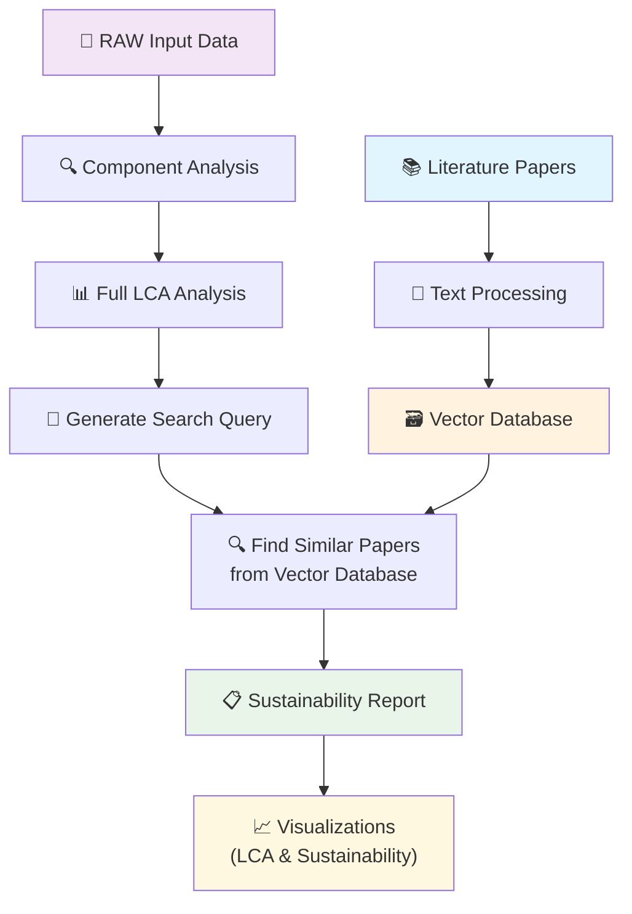

# First Approach - Prepared Literature Papers Workflow

## Workflow Description
1. **Literature Papers** → Text Processing → Vector Database (Pre-built database)
2. **RAW Input Data** → Component Analysis → Full LCA Analysis
3. **Generate Search Query** → Find Similar Papers from Vector Database
4. **Sustainability Report** → Visualizations

## Characteristics
- Uses pre-built vector database of literature papers
- Single search query approach
- Traditional LCA methodology
- May miss newer research papers 