# First Approach - Prepared Literature Papers Workflow

```mermaid
graph TD
    A["📚 Literature Papers"] --> B["🔄 Text Processing"]
    B --> C["🗃️ Vector Database"]
    
    D["📄 RAW Input Data"] --> E["🔍 Component Analysis"]
    E --> F["📊 Full LCA Analysis"]
    F --> G["🔎 Generate Search Query"]
    
    G --> H["🔍 Find Similar Papers<br/>from Vector Database"]
    C --> H
    
    H --> I["📋 Sustainability Report"]
    I --> J["📈 Visualizations<br/>(LCA & Sustainability)"]
    
    style A fill:#e1f5fe
    style D fill:#f3e5f5
    style C fill:#fff3e0
    style I fill:#e8f5e8
    style J fill:#fff8e1
```

## Workflow Description
1. **Literature Papers** → Text Processing → Vector Database (Pre-built database)
2. **RAW Input Data** → Component Analysis → Full LCA Analysis
3. **Generate Search Query** → Find Similar Papers from Vector Database
4. **Sustainability Report** → Visualizations

## Characteristics
- Uses pre-built vector database of literature papers
- Single search query approach
- Traditional LCA methodology
- May miss newer research papers 