# Second Approach - API-based Paper Download and Web Search Workflow (Current Implementation)

```mermaid
graph TD
    A["📄 RAW Input Data"] --> B["🔥 Hotspot Analysis"]
    
    B --> C["🎯 Generate Specific<br/>Search Queries<br/>(per hotspot)"]
    
    C --> D["📚 ArXiv API<br/>Paper Download"]
    D --> E["📄 PDF Processing"]
    
    E --> H["📋 Evidence-Based<br/>Sustainability Report"]
    
    C --> G["🌐 Web Search Tool<br/>(Quantitative Data)"]
    G --> H
    
    B --> H
    
    style A fill:#f3e5f5
    style B fill:#ffebee
    style C fill:#e3f2fd
    style D fill:#e8f5e8
    style E fill:#fff3e0
    style G fill:#e0f2f1
    style H fill:#e8f5e8
```

## Workflow Description
1. **RAW Input Data** → Hotspot Analysis (Direct hotspot identification)
2. **Generate Specific Search Queries** (One per hotspot)
3. **ArXiv API Paper Download** → PDF Processing → Evidence-Based Report
4. **Web Search Tool** (Independent quantitative data collection) → Evidence-Based Report
5. **Evidence-Based Sustainability Report** (Combines all inputs)

## Characteristics
- Dynamic paper discovery from ArXiv API
- Hotspot-specific search queries
- Real-time literature retrieval
- Independent web search for quantitative data augmentation
- Evidence-based approach with mandatory citations 